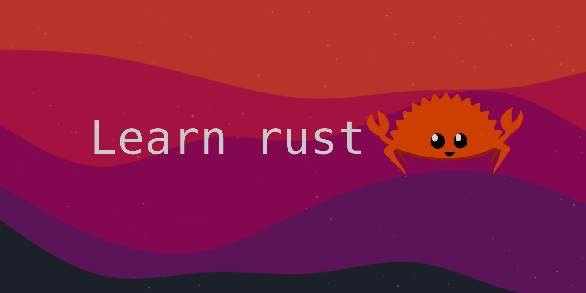
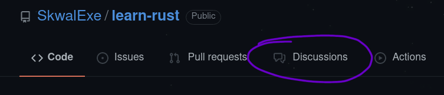

# Learn Rust 🦀 

This course was inspired by [Dcode](https://www.youtube.com/watch?v=vOMJlQ5B-M0&list=PLVvjrrRCBy2JSHf9tGxGKJ-bYAN_uDCUL)

Before starting to learn a programming language, you need to understand the basics of programming, **the algorithmics**. 🤓

**Are you french ? This course is available in french [here](https://github.com/SkwalExe/apprendre-rust/)**

# Table of Contents 📚
1. [Installing Rust 🦀](https://github.com/SkwalExe/learn-rust/tree/main/course/installing-rust/)
    - [Linux 😎](https://github.com/SkwalExe/learn-rust/tree/main/course/installing-rust#linux)
    - [Windows 💩](https://github.com/SkwalExe/learn-rust/tree/main/course/installing-rust#windows)
1. [Hello World 👋](https://github.com/SkwalExe/learn-rust/tree/main/course/hello-world/)
    - [Declaring a function](https://github.com/SkwalExe/learn-rust/tree/main/course/hello-world/#declaring-a-function)
    - [Printing a message 💬](https://github.com/SkwalExe/learn-rust/tree/main/course/hello-world/#printing-a-message)
    - [Compiling and running a program🏃‍](https://github.com/SkwalExe/learn-rust/tree/main/course/hello-world/#compiling-and-running-a-program) 

1. [Hello World with cargo 🚢](https://github.com/SkwalExe/learn-rust/tree/main/course/hello-world-cargo/)
    - [What is cargo❓](https://github.com/SkwalExe/learn-rust/tree/main/course/hello-world-cargo#what-is-cargo)
    - [Creating a new project🆕](https://github.com/SkwalExe/learn-rust/tree/main/course/hello-world-cargo#creating-a-new-project)
    - [Compiling and running a program with cargo🏃‍](https://github.com/SkwalExe/learn-rust/tree/main/course/hello-world-cargo#compiling-and-running-a-program-with-cargo)
        - [Just compiling](https://github.com/SkwalExe/learn-rust/tree/main/course/hello-world-cargo#just-compiling)
        - [Compiling and running🏃‍](https://github.com/SkwalExe/learn-rust/tree/main/course/hello-world-cargo#compiling-and-running)

1. [Variables 📦](https://github.com/SkwalExe/learn-rust/tree/main/course/variables/)
    - [Declaring a variable](https://github.com/SkwalExe/learn-rust/tree/main/course/variables#declaring-a-variable)
    - [Printing a variable💬](https://github.com/SkwalExe/learn-rust/tree/main/course/variables#printing-a-variable)
    - [Modifying a variable](https://github.com/SkwalExe/learn-rust/tree/main/course/variables#modifying-a-variable)
    - [Mutable variables](https://github.com/SkwalExe/learn-rust/tree/main/course/variables#mutable-variables)

1. [Variable data types](https://github.com/SkwalExe/learn-rust/tree/main/course/variable-data-types/)
    - [What are data types❓](https://github.com/SkwalExe/learn-rust/tree/main/course/variable-data-types#what-are-data-types)
    - [Specifying data types](https://github.com/SkwalExe/learn-rust/tree/main/course/variable-data-types#specifying-data-types)

1. [if else statements ❓](https://github.com/SkwalExe/learn-rust/tree/main/course/if-else-statements/)
    - [comparison operators](https://github.com/SkwalExe/learn-rust/tree/main/course/if-else-statements#comparison-operators)
    - [if](https://github.com/SkwalExe/learn-rust/tree/main/course/if-else-statements#if)
    - [else](https://github.com/SkwalExe/learn-rust/tree/main/course/if-else-statements#else)
    - [else if](https://github.com/SkwalExe/learn-rust/tree/main/course/if-else-statements#else-if)

1. [Infinite loops ♾️](https://github.com/SkwalExe/learn-rust/tree/main/course/infinite-loops/)
    - [the loop keyword ♾️](https://github.com/SkwalExe/learn-rust/tree/main/course/infinite-loops#the-loop-keyword️)
    - [the break keyword 🛑](https://github.com/SkwalExe/learn-rust/tree/main/course/infinite-loops#the-break-keyword)
    - [the continue keyword ➡️](https://github.com/SkwalExe/learn-rust/tree/main/course/infinite-loops#the-continue-keyword️)

1. [While loops 🔁](https://github.com/SkwalExe/learn-rust/tree/main/course/while-loops/)
    - [What is a while loop ❓](https://github.com/SkwalExe/learn-rust/tree/main/course/while-loops#what-is-a-while-loop)
    - [The while keyword 🔁](https://github.com/SkwalExe/learn-rust/tree/main/course/while-loops#the-while-keyword)
    - [The break and continue keywords 🔑](https://github.com/SkwalExe/learn-rust/tree/main/course/while-loops#the-break-and-continue-keywords)

1. [For loops 🔢](https://github.com/SkwalExe/learn-rust/tree/main/course/for-loops/)
    - [What is a for loop ❓](https://github.com/SkwalExe/learn-rust/tree/main/course/for-loops#what-is-a-for-loop)
    - [The `for` keyword 🔑](https://github.com/SkwalExe/learn-rust/tree/main/course/for-loops#the-for-keyword)
    - [Vector iteration](https://github.com/SkwalExe/learn-rust/tree/main/course/for-loops#vector-iteration)
        - [What is a vector❓](https://github.com/SkwalExe/learn-rust/tree/main/course/for-loops#what-is-a-vector)
        - [Declaring a vector](https://github.com/SkwalExe/learn-rust/tree/main/course/for-loops#declaring-a-vector)
        - [Iterating over a vector](https://github.com/SkwalExe/learn-rust/tree/main/course/for-loops#iterating-over-a-vector)
        - [Iterating over a vector with index 🔢](https://github.com/SkwalExe/learn-rust/tree/main/course/for-loops#iterating-over-a-vector-with-index)

1. [Enum types](https://github.com/SkwalExe/learn-rust/tree/main/course/enum-types/)
    - [What is an enum type ❓](https://github.com/SkwalExe/learn-rust/tree/main/course/enum-types#what-is-an-enum-type)
    - [Declaring an enum type](https://github.com/SkwalExe/learn-rust/tree/main/course/enum-types#declaring-an-enum-type)
    - [Matching on an enum](https://github.com/SkwalExe/learn-rust/tree/main/course/enum-types#matching-on-an-enum)
        - [What is a match expression ❓](https://github.com/SkwalExe/learn-rust/tree/main/course/enum-types#what-is-a-match-expression)
        - [Usage](https://github.com/SkwalExe/learn-rust/tree/main/course/enum-types#usage)
        - [Matching on an enum](https://github.com/SkwalExe/learn-rust/tree/main/course/enum-types#matching-on-an-enum)

1. [Constants](https://github.com/SkwalExe/learn-rust/tree/main/course/constants/)
    - [What is a constant ❓](https://github.com/SkwalExe/learn-rust/tree/main/course/constants#what-is-a-constant)
    - [Declaring a constant](https://github.com/SkwalExe/learn-rust/tree/main/course/constants#declaring-a-constant)
    - [Using a constant](https://github.com/SkwalExe/learn-rust/tree/main/course/constants#using-a-constant)

1. [Tuples](https://github.com/SkwalExe/learn-rust/tree/main/course/tuples/)
    - [What is a tuple ❓](https://github.com/SkwalExe/learn-rust/tree/main/course/tuples#what-is-a-tuple)
    - [Declaring a tuple](https://github.com/SkwalExe/learn-rust/tree/main/course/tuples#declaring-a-tuple)
    - [Accessing a tuple](https://github.com/SkwalExe/learn-rust/tree/main/course/tuples#accessing-a-tuple)
    - [Extracting values from a tuple 🚪](https://github.com/SkwalExe/learn-rust/tree/main/course/tuples#extracting-values-from-a-tuple)

1. [Functions 🛠️](https://github.com/SkwalExe/learn-rust/tree/main/course/functions/)
    - [What is a function❓](https://github.com/SkwalExe/learn-rust/tree/main/course/functions#what-is-a-function)
    - [Declaring a function](https://github.com/SkwalExe/learn-rust/tree/main/course/functions#declaring-a-function)
    - [Returning values](https://github.com/SkwalExe/learn-rust/tree/main/course/functions#returning-values)

1. [Code blocks 🟪](https://github.com/SkwalExe/learn-rust/tree/main/course/code-blocks/)
    - [What is a code block ❓](https://github.com/SkwalExe/learn-rust/tree/main/course/code-blocks/#what-is-a-code-block)
    - [Usage](https://github.com/SkwalExe/learn-rust/tree/main/course/code-blocks/#usage)

1. [Shadowing 👥](https://github.com/SkwalExe/learn-rust/tree/main/course/shadowing/)
    - [What is shadowing❓](https://github.com/SkwalExe/learn-rust/tree/main/course/shadowing#what-is-shadowing)
    - [Usage](https://github.com/SkwalExe/learn-rust/tree/main/course/shadowing#usage)

1. [References 🔗](https://github.com/SkwalExe/learn-rust/tree/main/course/references/)
    - [What is a reference ❔](https://github.com/SkwalExe/learn-rust/tree/main/course/references#what-is-a-reference)
    - [How to create a reference ❔](https://github.com/SkwalExe/learn-rust/tree/main/course/references#how-to-create-a-reference)
    - [How to use a reference 🤹](https://github.com/SkwalExe/learn-rust/tree/main/course/references#how-to-use-a-reference)
    - [Modifying a reference ✏️](https://github.com/SkwalExe/learn-rust/tree/main/course/references#modifying-a-reference)
        - [Firstly](https://github.com/SkwalExe/learn-rust/tree/main/course/references#firstly)
        - [Secondly](https://github.com/SkwalExe/learn-rust/tree/main/course/references#secondly)
    - [Warning ⚠️](https://github.com/SkwalExe/learn-rust/tree/main/course/references#warning)
        - [Firstly](https://github.com/SkwalExe/learn-rust/tree/main/course/references#firstly)
        - [Secondly](https://github.com/SkwalExe/learn-rust/tree/main/course/references#secondly)

1. [Structs 🧱](https://github.com/SkwalExe/learn-rust/tree/main/course/structs/)
    - [What is a struct ❔](https://github.com/SkwalExe/learn-rust/tree/main/course/structs#what-is-a-struct)
    - [How to create a struct ❔](https://github.com/SkwalExe/learn-rust/tree/main/course/structs#how-to-create-a-struct)
    - [How to use a struct 🤹](https://github.com/SkwalExe/learn-rust/tree/main/course/structs#how-to-use-a-struct)
    - [Modifying a struct ✏️](https://github.com/SkwalExe/learn-rust/tree/main/course/structs#modifying-a-struct)

1. [Tuple structs 🧱](https://github.com/SkwalExe/learn-rust/tree/main/course/tuple-structs/)
    - [What is a tuple struct ❔](https://github.com/SkwalExe/learn-rust/tree/main/course/tuple-structs#what-is-a-tuple-struct)
    - [How to create a tuple struct ❔](https://github.com/SkwalExe/learn-rust/tree/main/course/tuple-structs#how-to-create-a-tuple-struct)
    - [How to use a tuple struct 🤹](https://github.com/SkwalExe/learn-rust/tree/main/course/tuple-structs#how-to-use-a-tuple-struct)
    - [Modifying a tuple struct ✏️](https://github.com/SkwalExe/learn-rust/tree/main/course/tuple-structs#modifying-a-tuple-struct)

1. [Pass by reference 🖇️](https://github.com/SkwalExe/learn-rust/tree/main/course/pass-by-reference/)
    - [The problem ❌](https://github.com/SkwalExe/learn-rust/tree/main/course/pass-by-reference/#the-problem)
    - [The solution 💡](https://github.com/SkwalExe/learn-rust/tree/main/course/pass-by-reference/#the-solution)

# Have a question, want to show your project ?
### **You can open the Discussion 💬 tab on the top right corner of this page.**

# final
If you have any probleme, don't hesitate to open an issue
# contributing
Pull requests are welcome. For major changes, please open an issue first to discuss what you would like to change.
## Todo
- [ ] Add a section about the Rust language
- [ ] Add installation instructions for macOS