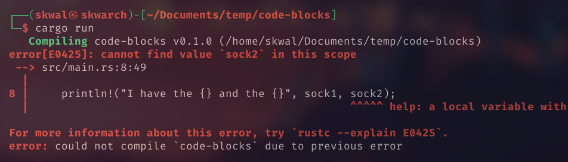

# Table of Contents📚
- [What is a code block ❓](#what-is-a-code-block)
- [Usage](#usage)

# Code Blocks🟪
## What is a code block❓
A code block is a piece of code between two `{}` that is kind of isolated from the rest of the code, but it can still access variables and functions from outside the code block.
## Usage
For example, we can use a code block to define and print a variable:
```rust
let sock1 = "First sock 🧦";

{
    let sock2 = "Second sock 🧦";
    println!("I have the {} and the {}", sock1, sock2);
}
```
Output:
```
I have the First sock 🧦 and the Second sock 🧦
```

Everything is working as expected, bur now, let's try to print the values of `sock1` and `sock2` outside the code block:
```rust
let sock1 = "First sock 🧦";

{
    let sock2 = "Second sock 🧦";
}

    println!("I have the {} and the {}", sock1, sock2);

```
Output:


We get the following error because `sock2` is not defined outside the code block

So the second sock disappears when the code block ends.
<!--
---

<p align="right"><a href="https://github.com/SkwalExe/learn-rust/tree/main/course/code-blocks">Next Section ⏭️</a></p>
-->

---

<p align="right">Course created by <a href="https://github.com/SkwalExe/" target="_blank">SkwalExe</a> and inspired by <a href="https://www.youtube.com/watch?v=vOMJlQ5B-M0&list=PLVvjrrRCBy2JSHf9tGxGKJ-bYAN_uDCUL" target="_blank">Dcode</a></p>