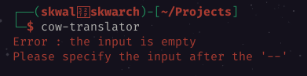
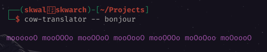

# Table of contents📚

- [What are command line arguments ❓](#what-are-command-line-arguments-)
- [The `env` module](#the-env-module)
- [Storing arguments in a vector](#storing-arguments-in-a-vector)
- [Exemple](#exemple)

# Commant line arguments💬

## What are command line arguments ❓

Commant line arguments are the keywords after the program name when you start it from a terminal.



Here, we start [cow-translator](https://github.com/SkwalExe/cow-translator)



Here we start the program with two command line arguments.

- `--`
- `bonjour`
  
Arguments are separated by a space.

## The `env` module

To access command line arguments from a rust program, we need to import the `env` module.

```rust
use std::env;
```

The `env` module allows us to access environment variables.

## Storing arguments in a vector

To store the arguments, we will use a String vector, to get the arguments we use the `args` method.

```rust
let mut args: Vec<String> = env::args().collect();
```

We use the `collect` method to store the arguments in a vector because `args()` returns an iterator. The `collect` method will convert the iterator into a vector.

Now let's see what our vector looks like.

```rust
let mut args: Vec<String> = env::args().collect();
println!("{:?}", args);
```

```bash
$ cargo run
["myProgram"]
```

We have the program name in the vector because it is always the 0th element.

We can remove it with the `remove(0)` method.

```rust
let mut args: Vec<String> = env::args().collect();
args.remove(0);
println!("{:?}", args);
```

```bash
$ cargo run
[]
```

We have an empty vector because we didn't pass any argument.

To pass arguments whan we use the `cargo run` command, we need to pass the arguments as arguments to the `cargo run` command after `--`

```bash
$ cargo run -- hello
["hello"]
```

We can now see that hello is in the arguments vector.

## Exemple

We will now create a simple program that says `hello {name}` and `name` is the first argument.

```rust
use std::env;

fn main(){
    let mut args: Vec<String> = env::args().collect();
    args.remove(0);
    println!("Hello {}", args[0]);
}
```
    
```bash
$ cargo run -- Skwal
Hello Skwal
```

---

<p align="right"><a href="https://skwalexe.github.io/learn-rust/">Home 🏠</a> - <a href="../writing-to-a-file">Next Section ⏭️</a></p>

---

<p align="right">Course created by <a href="https://github.com/SkwalExe/" target="_blank">SkwalExe</a> and inspired by <a href="https://www.youtube.com/watch?v=vOMJlQ5B-M0&list=PLVvjrrRCBy2JSHf9tGxGKJ-bYAN_uDCUL" target="_blank">Dcode</a></p>