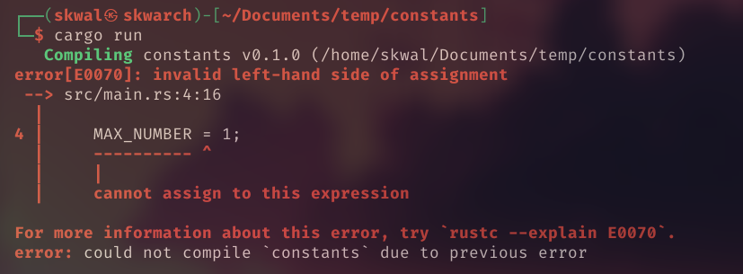

# Table of Contents📚
- [What is a constant ❓](#what-is-a-constant)
- [Declaring a constant](#declaring-a-constant)
- [Using a constant](#using-a-constant)


# Constants
## What is a constant❓
A constant is like a variable that can't be changed.
## Declaring a constant 
A constant can be declared with the `const` keyword, followed by the name of the constant, **the type**, and then the value of the constant. **The type of the constant have to be specified.**
> ℹ️ The constant name is conventionally capitalized, to know that it is a constant.

Example:
```rust
const TVA: u8 = 20;
```

> ℹ️ We use the datatype `u8` to represent an unsigned 8-bit integer, because `u8` can store values between 0 and 255 and the TVA will always be in this range. It is a good practice to use only the smallest datatype possible, it makes your code more performant.

## Using a constant
We can now use the constant in our code.
Example, print numbers from 1 to 10:
```rust
const MAX_NUMBER: u8 = 10;

fn main() {
    for i in 1..MAX_NUMBER {
        println!("{}", i);
    }
}
```
> ℹ️ Constants have to be declared out of the main function.

Output:
```
1
2
3
4
5
6
7
8
9
```

Since we are using a constant, we can't change its value, if we do, we will get the following error:



---

<p align="right"><a href="../tuples">Next Section ⏭️</a></p>

---

<p align="right">Course created by <a href="https://github.com/SkwalExe/" target="_blank">SkwalExe</a> and inspired by <a href="https://www.youtube.com/watch?v=vOMJlQ5B-M0&list=PLVvjrrRCBy2JSHf9tGxGKJ-bYAN_uDCUL" target="_blank">Dcode</a></p>