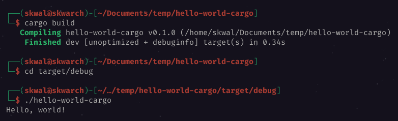
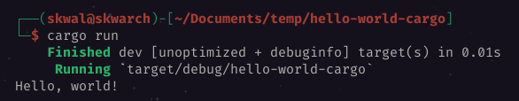

# Table of Contents📚
- [What is cargo?](#what-is-cargo)
- [Creating a new project](#creating-a-new-project)
- [Compiling and running a program with cargo](#compiling-and-running-a-program-with-cargo)
    - [Just compiling](#just-compiling)
    - [Compiling and running](#compiling-and-running)

# Hello world with cargo🚢
## What is cargo
Cargo is a **Rust package manager**. It is used to manage dependencies and build Rust projects.
## Creating a new project
We will create a new project called `hello-world-cargo`, to do this, we will use the following command.
> ℹ️ the `--bin` parameter flags the project as an application, not a library.
```bash
$ cargo new hello-world-cargo --bin

> Created binary (application) `hello-world-cargo` package.
```
This command created a new folder `📂 hello-world-cargo` in the current directory.
This folder contains a `📄 Cargo.toml` file, a `📂 src` folder and a `📄 main.rs` file.

```bash
hello-world-cargo
├── Cargo.toml
├── .git
│   └── ...
├── .gitignore
└── src
    └── main.rs
```

It also initialized a git repository for the project.

The `📂 src` folder contains the source code of the application, in it there already is a `📄 main.rs` file containing an hello world program.

```rust
// 📄 main.rs
fn main() {
    println!("Hello, world!");
}
```
## Compiling and running a program with cargo
### Just compiling
To compile the program, we will use the `cargo build` command.
```bash
# hello-world-cargo 📂
$ cargo build
```
This command will compile the program and create an executable file called `📄 hello-world-cargo` in the new `📂 target/debug` folder.

```bash
# hello-world-cargo/target/debug 📂
$ ./hello-world-cargo
> Hello, world!
```

### Compiling and running
To compile and run the program, we will use the `cargo run` command.
```bash
# hello-world-cargo 📂
$ cargo run
...
> Hello, world!
```


*And that's how we write an hello world program in rust with cargo !*


---

<p align="right"><a href="https://github.com/SkwalExe/learn-rust/tree/main/course/variables">Next Section ⏭️</a></p>

---


<p align="right">Course created by <a href="https://github.com/SkwalExe/" target="_blank">SkwalExe</a> and inspired by <a href="https://www.youtube.com/watch?v=vOMJlQ5B-M0&list=PLVvjrrRCBy2JSHf9tGxGKJ-bYAN_uDCUL" target="_blank">Dcode</a></p>