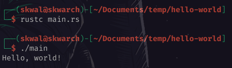

# Table of Contents📚

- [Declaring a function](#declaring-a-function)
- [Printing a message💬](#printing-a-message)
- [Compiling and running a program🏃](#compiling-and-running-a-program)

# Hello world👋

## Declaring a function

We will start this course by creating an hello world program with the rust 🦀 programming language.

First, we create a new folder `📂 hello-world` and a file `📄 main.rs` inside it.

> ℹ️ `.rs` is the extension for rust files.

We can now open the file `📄 main.rs` in our IDE, as well as a terminal of your choice, and start writing our program.

We declare a function called `main` because all rust programs begin with a function `main`.

```rust
// 📄 main.rs
fn main() {

}
```

> ℹ️ the `fn` keyword is used to declare a function.

> ℹ️ the lines starting with `//` are comments, they are ignored when executing the program.

## Printing a message💬

In the function, we will call the `println!` macro to print a message to the console. And we pass the string `Hello, world!` as an argument.

```rust
// 📄 main.rs
fn main() {
    println!("Hello, world 👋");
}
```

> ℹ️ All instructions end with a semicolon `;`

## Compiling and running a program🏃

Now that we have coded our program, we will compile it and run it.

to compile the program, we can use the `rustc` command.

```bash
$ rustc main.rs
```

> ℹ️ `$` : command

Running this command created an executable file called `📄 main` in the current directory that we can run by typing `./main`.

```bash
$ ./main
> Hello, world 👋
```

> ℹ️ `>` : Output of the command



---

<p align="right"><a href="https://skwalexe.github.io/learn-rust/">Home 🏠</a> - <a href="../hello-world-cargo">Next Section ⏭️</a></p>

---

<p align="right">Course created by <a href="https://github.com/SkwalExe/" target="_blank">SkwalExe</a> and inspired by <a href="https://www.youtube.com/watch?v=vOMJlQ5B-M0&list=PLVvjrrRCBy2JSHf9tGxGKJ-bYAN_uDCUL" target="_blank">Dcode</a></p>