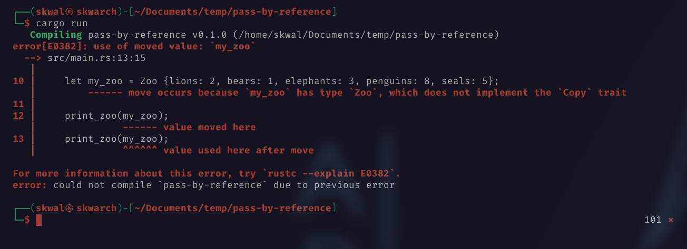

# Table of contents📚
- [The problem ❌](#the-problem)
- [The solution 💡](#the-solution)

# Pass by reference🖇️
## The problem❌
Let's try to create a function that takes one argument.

```rust
struct Zoo {
    lions: u8,
    bears: u8,
    elephants: u8,
    penguins: u8,
    seals: u8,
}

fn main() { 
    let my_zoo = Zoo {lions: 2, bears: 1, elephants: 3, penguins: 8, seals: 5};

    print_zoo(my_zoo);
}

fn print_zoo(zoo: Zoo) {
    println!("🐯 {}", zoo.lions);
    println!("🐻 {}", zoo.bears);
    println!("🐘 {}", zoo.elephants);
    println!("🐧 {}", zoo.penguins);
    println!("🦭 {}", zoo.seals);
}
```
the function `print_zoo` takes one argument of type `Zoo` (`my_zoo`).

The code works as expected.

Output:
```
🐯 2
🐻 1
🐘 3
🐧 8
🦭 5
```
But if we try to call the function again: 
```rust
print_zoo(my_zoo);
print_zoo(my_zoo);
```
we get the following error:



Simply because when we call `print_zoo`, the variable `my_zoo` is transferred from the scope of the main function to the scope of the `print_zoo` function.
## The solution💡
We can solve this problem by passing a reference to `my_zoo` instead of the variable itself when we call the function.

And we will have to make the function wait for the variable to be passed by reference.


```rust
struct Zoo {
    ...
}

fn main() { 
    let my_zoo = Zoo {lions: 2, bears: 1, elephants: 3, penguins: 8, seals: 5};

    print_zoo(&my_zoo);
    print_zoo(&my_zoo);
}

fn print_zoo(zoo: &Zoo) {
    ...
}
```
Output:
```
🐯 2
🐻 1
🐘 3
🐧 8
🦭 5
<------ Second call of the function
🐯 2
🐻 1
🐘 3
🐧 8
🦭 5
```


<!--
---

<p align="right"><a href="https://github.com/SkwalExe/learn-rust/tree/main/course/pass-by-reference">Next Section ⏭️</a></p>
-->

---

<p align="right">Course created by <a href="https://github.com/SkwalExe/" target="_blank">SkwalExe</a> and inspired by <a href="https://www.youtube.com/watch?v=vOMJlQ5B-M0&list=PLVvjrrRCBy2JSHf9tGxGKJ-bYAN_uDCUL" target="_blank">Dcode</a></p>