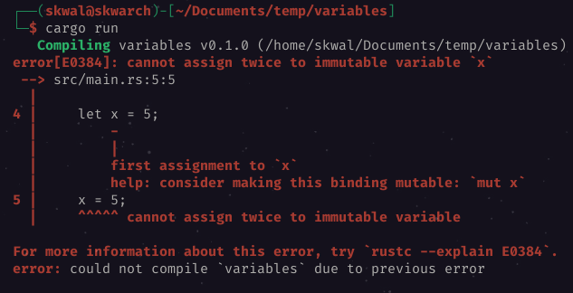

# Table of Contents
- [Declaring a variable](#declaring-a-variable)
- [Printing a variable](#printing-a-variable)
- [Modifying a variable](#modifying-a-variable)
- [Mutable variables](#mutable-variables)

# Variables
## Declaring a variable
To declare a variable, we use the keyword `let` followed by the name of the variable, and the value of the variable.

```rust
let x = 5;
```
We now have a variable `x` with the value `5`.
## Printing a variable
We can now use the variable `x` in our program.
For example, we can print the value of `x`:

```rust
let x = 5;
println!("The value of x is: {}", x);
```
The `{}` is a placeholder for the value of `x`. It will be replaced by its value when the program is executed.
If we run the program, we will see the following output:
```
The value of x is: 5
```
This program does the same as if we had written:
```rust
println!("The value of x is: {}", 5);
```
because `x` is replaced by its value.
## Modifying a variable
We can change the value of a variable by using the following syntax:

```rust
// declaring the variable
let x = 5;
// modifying the variable
x = 6;
```
But if we run this program, we will get the following error :


We get this error because, by default, variables are immutable. It means that we can't change their value.

## Mutable variables
We can set the variable to be mutable by using the keyword `mut` before the name of the variable.

```rust
let mut x = 5;
x = 6;
println!("The value of x is: {}", x);
```

Output:
```
The value of x is: 6
```

*And that's how we declare and use variables !*

---

Course created by [Skwal](https://github.com/SkwalExe/) and inspired by [Dcode](https://www.youtube.com/watch?v=vOMJlQ5B-M0&list=PLVvjrrRCBy2JSHf9tGxGKJ-bYAN_uDCUL)

